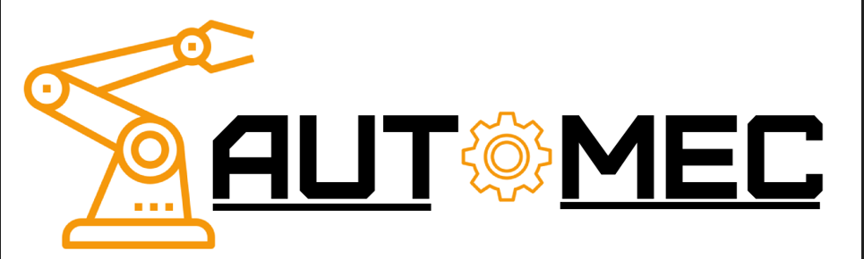
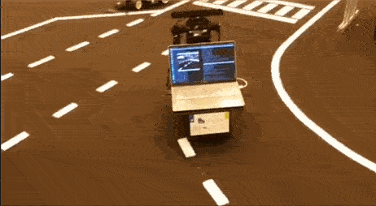
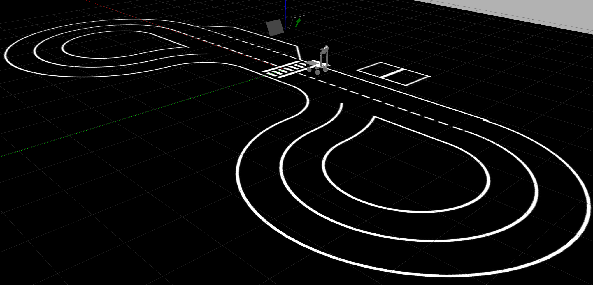
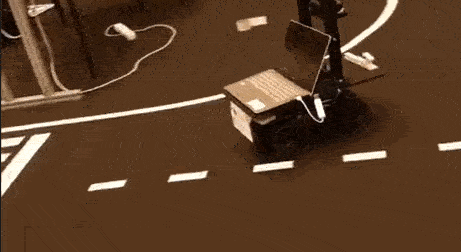
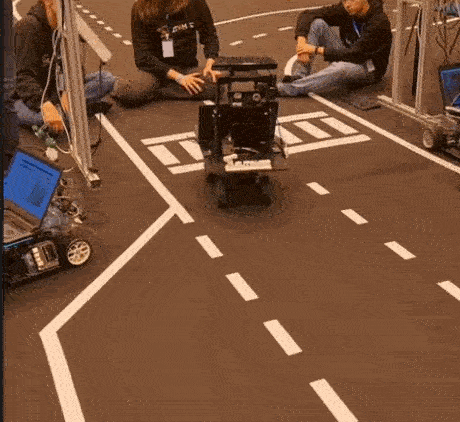

# AutoMec AD

This repository serves as the main repository for the autonomous RC car team of AutoMec AD. 
The software developed uses a CNN for lane detection and template matching for signal recognition.
All the software is incorporated into the ROS framework.
 
 

## How to run:

All the setup, commands and methods used are described in the [wiki](https://github.com/AutomecUA/AutoMec-AD/wiki).  

This is still a WIP. Some errors are to be expected. If you have any doubts or want to report a bug,
feel free to use the Issues or [send us an email](mailto:dem-automec@ua.pt)!

## Simulation Environment:
The software is developed and tested on a virtual environment named Gazebo. 

## Challenges
The autonomous vehicle aims to:
- Drive autonomously in a closed circuit
- Avoid objects
- Detect traffic lights and vertical signals
- Autonomously park

### Driving

### Parking 

