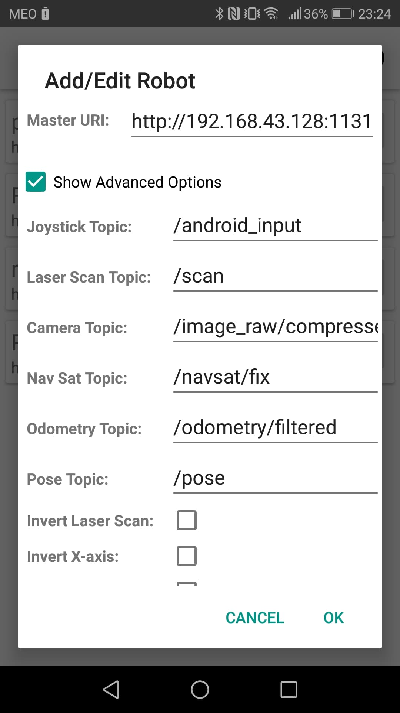

# Manual Driving 

# Indice
 - [App RosControl](#App-RosControl)
 - [PS3 Controller](#PS3Controller)

 # App RosControl

 * Run AndroidConversor

First, launch de Ros Master,

    roscore

Second, launch the conversor,

    rosrun core AndroidConversor.py

* Ros Control Instalation

The first step is to install the following android application: 

[Ros Control](https://play.google.com/store/apps/details?id=com.robotca.ControlApp&hl=en&gl=US)

* Ros Control Configuration

Click Add Robot, in the Robot name textbox, you can assign any name.
In the Master URI textbox you have to write something like this: http: // <ip_ros_master>: 1131

Where <ip_ros_master> is the ip of the computer where the rosmater is running.

Now, click in Show Advanced Options and change the Joystick Topic to "android_input", as shown in the next image.

It should be noted that the two devices need to be connected to the same network. If there are problems with the wireless network, make a hotspot with mobile data.

Now, just press OK!

